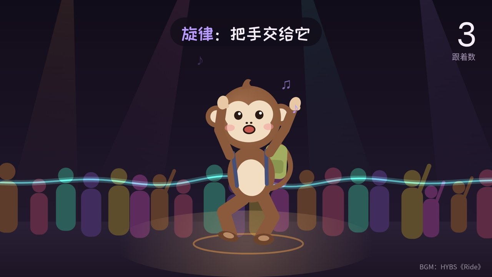

# 猴子律动课

跟着「幸福的猴子」，一关一关学会在 live house 里跟着节奏动起来。



## 在线体验

👉 https://monkey-groove.pages.dev

## 它能做什么

- **六关教学**：把乐队拆开，每件乐器交给身体的一个部位。咚（底鼓）交给膝盖，啪（军鼓）交给头和肩，嗡（贝斯）交给胯，旋律交给手，最后全部忘掉。
- **六种曲风**：独立摇滚、朋克、电子、嘻哈、民谣、后摇，每种都有自己的伴奏和「身体配方」。
- **动作拆解**：猴子停在每个关键姿势上，圈出正在动的部位，可以一步一步看。
- **找拍子练习**：跟着缩小的圆圈点拍子，逐级撤掉提示，最后在人声、观众噪音和鼓声暂停里也能找到拍子。
- **用自己的歌**：选一首手机或电脑里的歌，页面自动分析节拍，猴子会跟着这首歌跳；分析不准时可以跟着歌拍 8 下校准。

## 本地运行

这是一个没有依赖、不需要构建的单文件网页。直接用浏览器打开 `index.html` 就能用，或者在这个文件夹里起一个本地服务器：

```bash
python3 -m http.server 8080
# 然后打开 http://localhost:8080
```

## 部署

用 Cloudflare Pages 连接这个仓库即可，构建设置全部留空：

| 设置 | 值 |
|---|---|
| Framework preset | None |
| Build command | （留空） |
| Build output directory | `/` |

之后每次 push 到 `main` 分支，网站会自动更新。

## 技术说明

- 所有代码都在 `index.html` 里：动画用 Canvas 绘制，伴奏用 Web Audio 实时合成。
- 「用我的歌」的节拍分析完全在浏览器里完成，歌曲不会上传到任何地方。
- 节拍分析适合速度稳定、鼓点清楚的 4/4 拍歌曲；速度会变的现场录音、没有鼓的歌和非 4/4 拍的歌可能不准，可以用「跟着歌拍 8 下校准」修正。

## 文件结构

```
index.html        整个网页
docs/preview.jpg  README 里的预览图
README.md         说明文档
```

---

© 幸福的猴子
